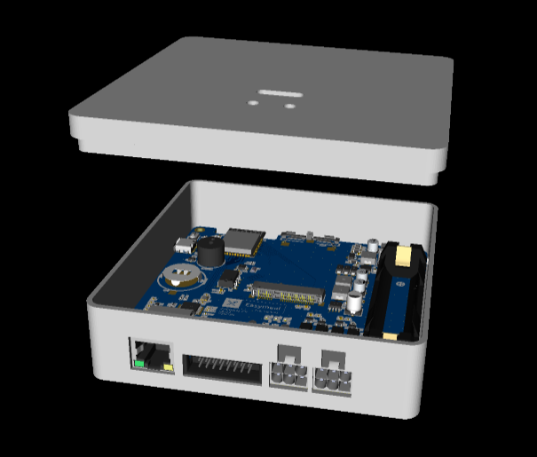
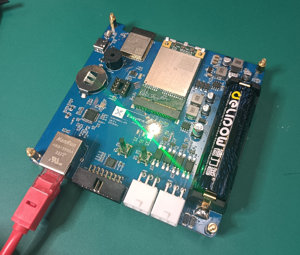

# PCBCrew Easymeal IoT

SP32 based vending machine controller board with Ethernet, Wi-Fi, and 4G LTE connectivity

| 3D Preview                                                     | PCBA                                                       |
| -------------------------------------------------------------- | ---------------------------------------------------------- |
|  |  |

* ESP32-S3
* Wiznet W5500 Ethernet Controller
* Mini-PCIe connector for a Quectel/Simcom 4G LTE module
* RS232 UART port via push-pull connector
* Dual MDB connectors for vending macine interfacing
* On-board backup 18650 battery holder and charger
* DS1337 RTC and CR2032 battery holder
* DIP8 connector for 24Cxx EEPROM
* A few buttons and LEDs
* USB 2.0 Type-C connector for debugging

## Pin Assignments

### On-board peripherals

| Device          | Net name  | ESP32-S3 |
| --------------- | --------- | -------- |
| Action LED      | LED_ACT   | GPIO_9   |
| Battery charger | BAT_CHARG | GPIO_8   |
| Pushbutton 1    | BTN1      | GPIO_37  |
| Pushbutton 2    | BTN2      | GPIO_36  |
| I2C SCL         | SCL       | GPIO_5   |
| I2C SDA         | SDA       | GPIO_4   |

### MDB interface

| Device          | Net name  | ESP32-S3 |
| --------------- | --------- | -------- |
| MDB 1 Tx        | M1_TX     | GPIO_16  |
| MDB 1 Rx        | M1_RX     | GPIO_15  |
| MDB 2 Tx        | M2_TX     | GPIO_18  |
| MDB 2 Rx        | M2_RX     | GPIO_17  |

### W5500 Ethernet controller

| W5500 | Net name   | ESP32-S3 |
| ----- | ---------- | -------- |
| SCLK  | SPI2_SCK   | GPIO_12  |
| MOSI  | SPI2_MOSI  | GPIO_11  |
| MISO  | SPI2_MISO  | GPIO_13  |
| SCSn  | SPI2_CS0   | GPIO_10  |
| RSTn  | SPI2_RESET | GPIO_47  |
| INTn  | SPI2_INT   | GPIO_48  |

### Quectel EC25

| Modem         | PCIe    | ESP32-S3 |
| ------------- | ------- | -------- |
| MODEM_RST     | PCIE_22 | GPIO_35  |
| MODEM_UART_TX | PCIE_13 | GPIO_44  |
| MODEM_UART_RX | PCIE_11 | GPIO_43  |
| MODEM_RTS     | PCIE_25 | GPIO_39  |
| MODEM_CTS     | PCIE_23 | GPIO_40  |

### Simcom SIM7600

| Modem         | PCIe    | ESP32-S3 |
| ------------- | ------- | -------- |
| MODEM_RST     | PCIE_22 | GPIO_35  |
| MODEM_CTS     | PCIE_11 | GPIO_43  |
| MODEM_RTS     | PCIE_13 | GPIO_44  |
| MODEM_UART_TX | PCIE_19 | GPIO_41  |
| MODEM_UART_RX | PCIE_17 | GPIO_42  |
